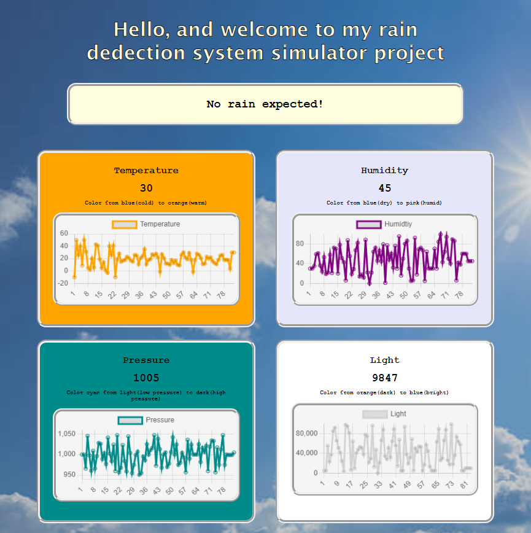
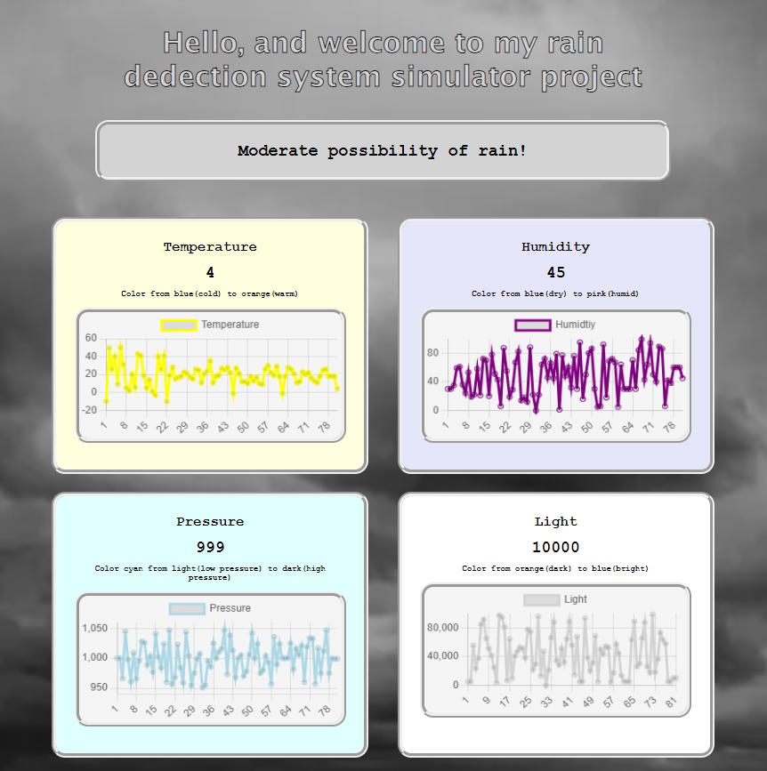
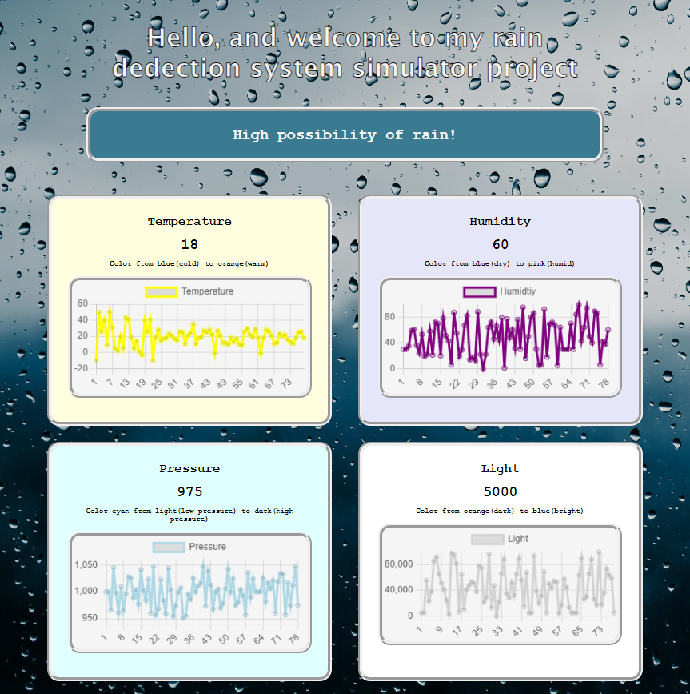

# IOT_Rain-detection-system
A project to simulate a NodeMCU reading data from connected sensors and sending the data to a website, using WinForms, ASP.NET WebAPI and basic HTML, CSS and JS with Chart.js as the library used to generate the value line charts.

To simulate the NodeMCU microcontroller I used a C# WinForms app that would serve to generate the data that the sensors tied to the microcontroller would have done.

For it to be a IOT system it has to be connected to the internet and in this project this is achieved by an ASP.NET WebAPI connected to the same database that the WinForsm app is using.

To this WebAPI I have connected a website which displays the latest data from the databse in set intervals as to simulate continuous data flow from the NodeMCU.

</img> 
Simulator  
Website look and style based on the chance of rain

  </img>
  </img>
  </img>

