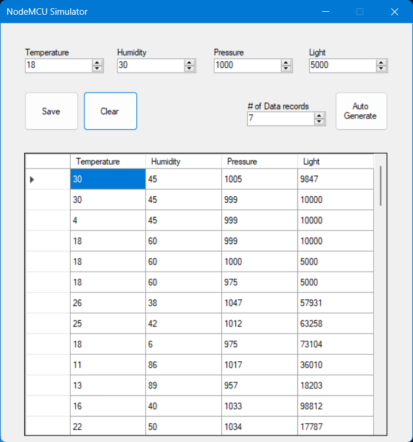

# IOT_Rain-detection-system
A project to simulate a NodeMCU reading data from connected sensors and sending the data to a website, using WinForms, ASP.NET WebAPI and basic HTML, CSS and JS with Chart.js as the library used to generate the value line charts.

This is a project for my Design and development of IOT systems class. For those of us unlucky enough not to be able to get our hands on the required hardware, we were required to make a simulator for the NodeMCU microcontroller using a C# WinForms app that would serve to generate the data that the sensors tied to the microcontroller would have done.
For it to be a IOT system it has to be connected to the internet and in this project this is achieved by an ASP.NET WebAPI connected to the same database that the WinForsm app is using.
To this WebAPI I have connected a basic website which displays the latest data from the databse in set intervals as to simulate continuous data flow from the NodeMCU.

Simulator screenshot

Sunny day screenshot

Cloudy day screenshot

Rainy day screenshot

